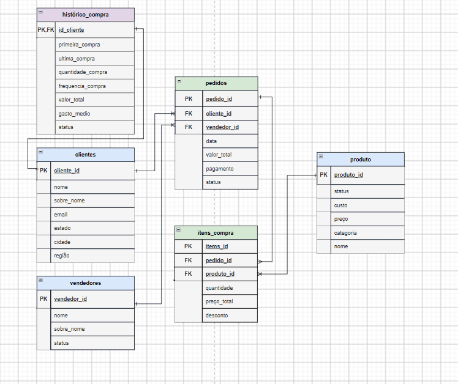

# Modelagem de Dados — NovaMarket

## 1. Objetivo

A modelagem de dados da NovaMarket tem como objetivo estruturar e relacionar os dados de clientes, pedidos, produtos, vendedores e histórico de compras, garantindo organização e integridade dos dados.

A estrutura foi desenvolvida a partir dos requisitos funcionais, requisitos de dados e regras de negócio definidos no projeto no documento de requisitos.

---

## 2. Entidades

O modelo inicial é composto pelas seguintes entidades:

- **Clientes** — informações cadastrais dos clientes.
- **Histórico de Compra** — informações relacionadas ao histórico de compras dos clientes.
- **Pedidos** — registros das compras realizadas.
- **Itens de Compra** — produtos pertencentes a cada pedido.
- **Produtos** — produtos comercializados pela NovaMarket.
- **Vendedores** — vendedores relacionados aos pedidos.

---

## 3. Principais atributos

### Clientes
- `client_id` — PK
- `name`- VAR
- `last_name` - VAR
- `email` - VAR
- `estate` - VAR
- `city` - VAR
- `region` - VAR

### Histórico de Compra
- `cliente_id_history` — PK, FK
- `first_purchase` - DATE
- `last_purchase` - DATE
- `total_orders` - INT
- `total_spent` - INT
- `crm_status` - ENUM
- `avg_order_value` - DEC

### Pedidos
- `order_id` — PK
- `cliente_id` — FK
- `seller_id` — FK
- `date_order` - DATE
- `total_price` - DEC
- `pay_method` - ENUM
- `status`- ENUM

### Itens de Compra
- `item_id` — PK
- `order_id` — FK
- `product_id` — FK
- `price_unit`- DEC
- `amount`- INT
- `discount` - DEC
- `total_price` DEC

### Produtos
- `produtc_id` — PK
- `name`- VAR
- `cost`- DEC
- `price`- DEC
- `category`- VAR

### Vendedores
- `seller_id` — PK
- `first_name`- VAR
- `last_name` - VAR
- `status` - ENUM
- `salary` - DEC

---

## 4. Relacionamentos

| Relacionamento | Cardinalidade |
|---|---|
| Clientes → Pedidos | 1:N |
| Clientes → Histórico de Compra | 1:1 |
| Vendedores → Pedidos | 1:N |
| Pedidos → Itens de Compra | 1:N |
| Produtos → Itens de Compra | 1:N |

A entidade `itens_compra` representa a relação entre pedidos e produtos, permitindo que um pedido possua vários produtos e que um produto esteja presente em diferentes pedidos.

---

## 5. Chaves

### Chaves primárias

- `clientes.cliente_id`
- `histórico_compra.id_cliente`
- `pedidos.pedido_id`
- `itens_compra.itens_id`
- `produto.produto_id`
- `vendedores.vendedor_id`

### Chaves estrangeiras

- `histórico_compra.id_cliente` → `clientes.cliente_id`
- `pedidos.cliente_id` → `clientes.cliente_id`
- `pedidos.vendedor_id` → `vendedores.vendedor_id`
- `itens_compra.pedido_id` → `pedidos.pedido_id`
- `itens_compra.produto_id` → `produto.produto_id`

---

## 6. Diagrama

  

---

## 7. Observação

A modelagem representa a estrutura de dados necessária para o funcionamento do projeto NovaMarket.

Os dados armazenados poderão posteriormente ser utilizados em consultas SQL e análises complementares com Python.

Os cálculos e análises de indicadores, como faturamento, lucro, margem e outros KPIs, não fazem parte da estrutura do banco nesta etapa.

## 8. CRM e Régua de Comunicação

A modelagem da NovaMarket foi estruturada para fornecer os dados necessários à aplicação de estratégias de CRM e retenção de clientes.

A partir do relacionamento entre clientes, será possível classificá-los de acordo com suas compras.

Os principais grupos considerados na régua de comunicação são:

- Classificação 
  * Cliente novo
  * Cliente recorrente
  * Cliente em risco
  * Churn

-  Estratégia de CRM |
  * Comunicação de boas-vindas
  * Recomendação de produtos e notificações
  * Ofertas e descontos para recuperação
  * Comunicação personalizada e cupom de desconto

A régua de comunicação representa uma estratégia de CRM baseada no estágio do relacionamento do cliente com a NovaMarket, permitindo direcionar diferentes ações para cada grupo.